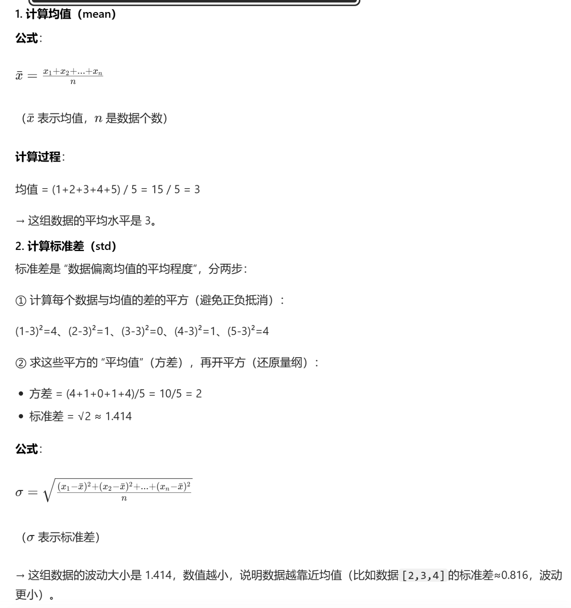

# 什么是梯度？ gradient
PyTorch 中的梯度 = 「损失函数对每个参数的偏导数」按参数的形状 “一一对应” 存储在张量中，单参数是标量张量、多参数是向量张量、矩阵参数是矩阵张量，本质就是偏导数的 “结构化集合”。

正因为梯度是 “按参数形状存储偏导数”，所以：
训练时必须用 optimizer.zero_grad() 清零梯度 —— 因为 PyTorch 会累加梯度（多次反向传播不清零，偏导数会叠加），这是工程实现的特性，和纯数学的 “梯度是某一点的静态值” 不同；
梯度的形状永远和参数一致 —— 比如参数 W 是 [5, 10] 的矩阵，W.grad 也一定是 [5, 10]，每个位置 W.grad[i][j] 就是 ∂Loss/∂W[i][j]。
最终总结

核心对应：PyTorch 梯度张量的每个元素 = 数学上损失函数对对应位置参数的偏导数；
存储形式：梯度的形状和参数完全一致（标量 / 向量 / 矩阵 / 高维张量），本质是偏导数的结构化存储；
工程特性：梯度会累加，训练时需手动清零，这是框架实现的细节，而非数学定义。

## 怎样计算梯度？
grad 是 gradient 的缩写，也就是梯度的意思
```
# 设置自动求导
x = torch.randn(2, 2, requires_grad=True)
result = x * 2

# 触发「反向传播」，自动计算当前张量对所有依赖的、
# 开启梯度追踪（requires_grad=True）的参数的梯度，并把梯度存储到这些参数的 .grad 属性中。
result.backward()
print(result.grad)  # 打印梯度

```

# 神经网络 neural network

## 神经网络分类
### 1. FNN = 前馈神经网络（Feedforward Neural Network，FNN）
FNN 是神经网络家族中的基本单元。
前馈神经网络特点是数据从输入层开始，经过一个或多个隐藏层，最后到达输出层，全过程没有循环或反馈。

### 2. RNN = 循环神经网络（Recurrent Neural Network, RNN）
RNN 是一类专门处理序列数据的神经网络，能够捕获输入数据中时间或顺序信息的依赖关系。

RNN 的特别之处在于它具有"记忆能力"，可以在网络的隐藏状态中保存之前时间步的信息。

循环神经网络用于处理随时间变化的数据模式。

在 RNN 中，相同的层被用来接收输入参数，并在指定的神经网络中显示输出参数。

### 3. CNN = Convolutional Neural Network，卷积神经网络
CNN 是什么？一句话 + 通俗讲透
最简单理解：CNN 就是专门用来处理「图片、图像、视频、语音」这类网格状数据的神经网络。 


# 数据 dateset

均值（mean）	一组数据的 “平均水平”，把所有数加起来除以数的个数	一张图片 R 通道所有像素值的平均值（比如 0.485）
标准差（std）	一组数据的 “离散程度 / 波动大小”：数值越小，数据越集中；越大，数据越分散	R 通道像素值偏离均值的程度（比如 0.229）

用最简单的例子理解（非图像）
假设我们有一组数据：[1, 2, 3, 4, 5]，一步步计算均值和标准差：
## 1. 计算均值（mean）
公式：xˉ=(x1+x2+x3+...+xn)​/n（xˉ 表示均值，n 是数据个数）

计算过程：均值 = (1+2+3+4+5) / 5 = 15 / 5 = 3

## 2. 计算标准差（std）
标准差是 “数据偏离均值的平均程度”，分两步：① 计算每个数据与均值的差的平方（避免正负抵消）：

(1-3)²=4、(2-3)²=1、(3-3)²=0、(4-3)²=1、(5-3)²=4② 求这些平方的 “平均值”（方差），再开平方（还原量纲）：

方差 = (4+1+0+1+4)/5 = 10/5 = 2
标准差 = √2 ≈ 1.414

公式：σ=n(x1​−xˉ)2+(x2​−xˉ)2+...+(xn​−xˉ)2​​（σ 表示标准差）



# 线性回归 linear regression