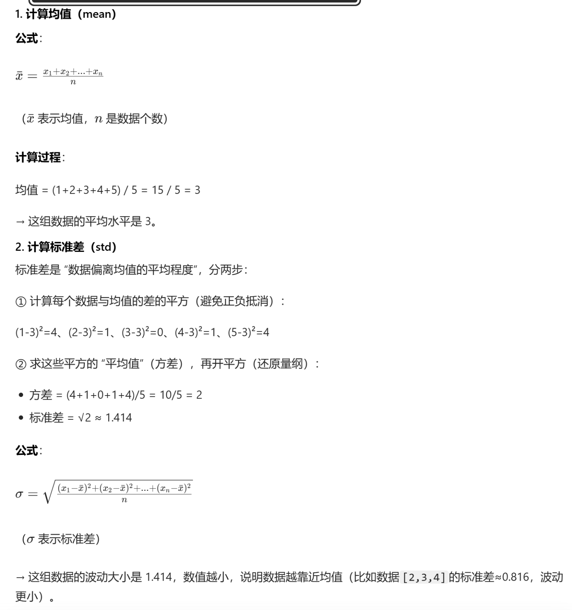

# 学习资料
PyTorch 教程 (https://www.runoob.com/pytorch/pytorch-cnn.html)

# 梯度 gradient
## 什么是梯度？ gradient

**梯度：损失对参数的偏导数，形状与参数相同，PyTorch 中会累加，必须清零。**
## 梯度的作用（通俗 + 核心总结）
梯度是深度学习能训练、模型能学会的核心，一句话总结：
- 梯度 = 方向 + 大小，告诉模型怎么改参数才能让损失变小。

### 1. 梯度到底是什么？
- 梯度是损失函数对参数的导数
- 代表：参数改变一点点，损失会怎么变
- 自带两个关键信息：
    1. 方向：参数往哪边调，损失会下降
    2. 大小：调多少（下降速度快慢）


### 2. 梯度的核心作用（3 条必记）
1. 指引参数更新方向（最关键）
没有梯度，模型就是瞎猜。梯度告诉权重 w、偏置 b：
- 往正方向调，还是负方向调
- 才能让预测更准、损失更小

2. 控制更新步长
- 梯度绝对值越大 → 说明当前位置离最优解很远 → 步子迈大
- 梯度绝对值越小 → 说明快到最优解 → 步子迈小
3. 实现自动学习
- 深度学习不需要人工调参，全靠反向传播计算梯度 → 用梯度更新参数
- 这就是神经网络能 “学习” 的根本原理。


## 怎样计算梯度？
grad 是 gradient 的缩写，也就是梯度的意思
```
# 设置自动求导
x = torch.randn(2, 2, requires_grad=True)
result = x * 2

# 触发「反向传播」，自动计算当前张量对所有依赖的、
# 开启梯度追踪（requires_grad=True）的参数的梯度，并把梯度存储到这些参数的 .grad 属性中。
result.backward()
print(result.grad)  # 打印梯度

```

# 神经网络 neural network

## 神经网络分类
### 1. FNN = 前馈神经网络（Feedforward Neural Network，FNN）
FNN 是神经网络家族中的基本单元。
前馈神经网络特点是数据从输入层开始，经过一个或多个隐藏层，最后到达输出层，全过程没有循环或反馈。

### 2. RNN = 循环神经网络（Recurrent Neural Network, RNN）
RNN 是一类专门处理序列数据的神经网络，能够捕获输入数据中时间或顺序信息的依赖关系。

RNN 的特别之处在于它具有"记忆能力"，可以在网络的隐藏状态中保存之前时间步的信息。

循环神经网络用于处理随时间变化的数据模式。

在 RNN 中，相同的层被用来接收输入参数，并在指定的神经网络中显示输出参数。

### 3. CNN = Convolutional Neural Network，卷积神经网络
CNN 是什么？一句话 + 通俗讲透
最简单理解：CNN 就是专门用来处理「图片、图像、视频、语音」这类网格状数据的神经网络。 


# 数据 dateset

均值（mean）	一组数据的 “平均水平”，把所有数加起来除以数的个数	一张图片 R 通道所有像素值的平均值（比如 0.485）
标准差（std）	一组数据的 “离散程度 / 波动大小”：数值越小，数据越集中；越大，数据越分散	R 通道像素值偏离均值的程度（比如 0.229）

用最简单的例子理解（非图像）
假设我们有一组数据：[1, 2, 3, 4, 5]，一步步计算均值和标准差：
## 1. 计算均值（mean）
公式：xˉ=(x1+x2+x3+...+xn)​/n（xˉ 表示均值，n 是数据个数）

计算过程：均值 = (1+2+3+4+5) / 5 = 15 / 5 = 3

## 2. 计算标准差（std）
标准差是 “数据偏离均值的平均程度”，分两步：① 计算每个数据与均值的差的平方（避免正负抵消）：

(1-3)²=4、(2-3)²=1、(3-3)²=0、(4-3)²=1、(5-3)²=4② 求这些平方的 “平均值”（方差），再开平方（还原量纲）：

方差 = (4+1+0+1+4)/5 = 10/5 = 2
标准差 = √2 ≈ 1.414

公式：σ=n(x1​−xˉ)2+(x2​−xˉ)2+...+(xn​−xˉ)2​​（σ 表示标准差）



# 线性回归 linear regression

## 一、核心步骤（6 步）
1. 准备数据
构造 / 加载特征x和标签y
转换为 PyTorch 张量（Tensor），并设置requires_grad=False（数据不需要求导）
2. 定义模型
继承nn.Module，或直接使用nn.Linear
模型作用：输入x，输出预测值y_pred
3. 定义损失函数
回归任务用 均方误差（MSELoss）
作用：计算预测值和真实值的差距
4. 定义优化器
常用 SGD / Adam
作用：更新模型参数，缩小损失
必须传入 ** 模型参数model.parameters()** 和学习率lr
5. 训练循环（核心）
重复 N 次迭代：
- 前向传播：输入x得到y_pred
- 计算损失：loss = criterion(y_pred, y)
- 梯度清零：optimizer.zero_grad()（必须！防止梯度累加）
- 反向传播：loss.backward()（计算参数梯度）
- 更新参数：optimizer.step()（用梯度优化模型）
6. 测试 / 使用模型
用训练好的模型做预测
绘制拟合曲线 / 查看最终参数

## 二、极简代码模板（对应步骤）
```python
 import torch
import torch.nn as nn

# 1. 准备数据
x = torch.tensor([[1.0], [2.0], [3.0]], dtype=torch.float32)
y = torch.tensor([[2.0], [4.0], [6.0]], dtype=torch.float32)

# 2. 定义模型（线性回归 y = wx + b）
model = nn.Linear(in_features=1, out_features=1)

# 3. 定义损失函数
criterion = nn.MSELoss()

# 4. 定义优化器
optimizer = torch.optim.SGD(model.parameters(), lr=0.01)

# 5. 训练循环
epochs = 1000
for epoch in range(epochs):
    # 前向传播
    y_pred = model(x)
    # 计算损失
    loss = criterion(y_pred, y)
    
    # 反向传播 + 更新
    optimizer.zero_grad()  # 梯度清零
    loss.backward()        # 反向求导
    optimizer.step()       # 更新参数
    
    # 打印日志
    if (epoch+1) % 100 == 0:
        print(f'Epoch [{epoch+1}], Loss: {loss.item():.4f}')

# 6. 测试预测
print("预测结果:", model(torch.tensor([[4.0]])))
```
## 三、关键必记知识点
1. 张量格式：数据必须是torch.Tensor，且维度匹配
2. 梯度清零：每次迭代必须zero_grad()，否则梯度会累加
3. 三大核心组件
- 模型（nn.Module）：计算预测值
- 损失函数：衡量误差
- 优化器：更新参数
4. 不求导数据：输入x和标签y不需要设置requires_grad=True
## 总结
1. 数据转张量 → 定义线性模型 → 选损失 + 优化器
2. 循环：前向 → 算损失 → 清零梯度 → 反向传播 → 更新参数
3. 训练完成后用模型预测

# CNN 卷积神经网络
PyTorch 卷积神经网络 (Convolutional Neural Networks, CNN) 是一类专门用于处理具有网格状拓扑结构数据（如图像）的深度学习模型。

CNN 是计算机视觉任务（如图像分类、目标检测和分割）的核心技术。

下面这张图展示了一个典型的卷积神经网络（CNN）的结构和工作流程，用于图像识别任务


以下是各个部分的简要说明：

- 输入图像（Input Image）：网络接收的原始图像数据。
- 卷积（Convolution）：使用卷积核（Kernel）在输入图像上滑动，提取特征，生成特征图（Feature Maps）。
- 池化（Pooling）：通常在卷积层之后，通过最大池化或平均池化减少特征图的尺寸，同时保留重要特征，生成池化特征图（Pooled Feature Maps）。
- 特征提取（Feature Extraction）：通过多个卷积和池化层的组合，逐步提取图像的高级特征。
- 展平层（Flatten Layer）：将多维的特征图转换为一维向量，以便输入到全连接层。
- 全连接层（Fully Connected Layer）：类似于传统的神经网络层，用于将提取的特征映射到输出类别。
- 分类（Classification）：网络的输出层，根据全连接层的输出进行分类。
- 概率分布（Probabilistic Distribution）：输出层给出每个类别的概率，表示输入图像属于各个类别的可能性。


## 一、核心 7 大步骤（必背）
1. 准备数据集 + 数据加载
- 准备图像数据集（训练集 + 测试集）
- 用数据预处理（归一化、Resize、增强等）
- 构建 Dataset + DataLoader（批量加载、打乱数据）
2. 定义 CNN 网络模型
- 继承 nn.Module
- 搭建卷积层 (Conv2d) + 池化层 (MaxPool2d) + 全连接层 (Linear)
- 最后输出分类概率 / 类别
3. 定义训练设备
- 指定 CPU/GPU（cuda 优先）
4. 定义损失函数
- 分类任务用 交叉熵损失 CrossEntropyLoss
- 回归任务用 MSELoss
5. 定义优化器
- 常用 Adam / SGD
- 传入模型参数 + 学习率
6. 训练循环（核心）
- 重复多轮：
- 读取批量数据 → 搬到设备上
- 前向传播 → 得到预测值
- 计算损失
- 梯度清零 optimizer.zero_grad()（必须！防止梯度累加）
- 反向传播 loss.backward()（计算参数梯度）
- 更新参数 optimizer.step()（用梯度优化模型）
- 计算准确率、打印日志
7. 模型测试 / 评估
- 关闭梯度计算 torch.no_grad()（不计算梯度，速度快）
- 用测试集计算准确率
- 保存 / 使用训练好的模型
## 二、极简代码模板（对应步骤）
```python
import torch
import torch.nn as nn
import torch.optim as optim
from torchvision import datasets, transforms
from torch.utils.data import DataLoader

# ===================== 1. 数据加载 =====================
transform = transforms.Compose([
    transforms.ToTensor(),  # 转张量
    transforms.Normalize((0.5,), (0.5,))  # 归一化
])

# 下载训练集&测试集（以MNIST为例）
train_dataset = datasets.MNIST(root='data', train=True, download=True, transform=transform)
test_dataset = datasets.MNIST(root='data', train=False, download=True, transform=transform)

# 批量加载器
train_loader = DataLoader(train_dataset, batch_size=64, shuffle=True)
test_loader = DataLoader(test_dataset, batch_size=64, shuffle=False)

# ===================== 2. 定义CNN模型 =====================
class CNN(nn.Module):
    def __init__(self):
        super(CNN, self).__init__()
        # 卷积 + 池化 块
        self.conv1 = nn.Conv2d(1, 16, 3, padding=1)  # 输入通道1，输出16
        self.pool = nn.MaxPool2d(2, 2)               # 池化
        self.conv2 = nn.Conv2d(16, 32, 3, padding=1)
        # 全连接层
        self.fc1 = nn.Linear(32 * 7 * 7, 128)
        self.fc2 = nn.Linear(128, 10)  # 10分类

    def forward(self, x):
        x = self.pool(torch.relu(self.conv1(x)))
        x = self.pool(torch.relu(self.conv2(x)))
        x = x.view(-1, 32 * 7 * 7)  # 展平
        x = torch.relu(self.fc1(x))
        x = self.fc2(x)
        return x

# ===================== 3. 指定设备 =====================
device = torch.device('cuda' if torch.cuda.is_available() else 'cpu')
model = CNN().to(device)

# ===================== 4. 损失函数 =====================
criterion = nn.CrossEntropyLoss()

# ===================== 5. 优化器 =====================
optimizer = optim.Adam(model.parameters(), lr=0.001)

# ===================== 6. 训练循环 =====================
epochs = 5
for epoch in range(epochs):
    model.train()  # 训练模式
    running_loss = 0.0
    for images, labels in train_loader:
        # 数据搬到GPU/CPU
        images, labels = images.to(device), labels.to(device)
        
        # 前向传播
        outputs = model(images)
        loss = criterion(outputs, labels)
        
        # 反向传播 + 更新
        optimizer.zero_grad()
        loss.backward()
        optimizer.step()
        
        running_loss += loss.item()
    
    print(f'Epoch {epoch+1}, Loss: {running_loss/len(train_loader):.4f}')

# ===================== 7. 模型测试 =====================
model.eval()  # 测试模式
correct = 0
total = 0
with torch.no_grad():  # 关闭梯度
    for images, labels in test_loader:
        images, labels = images.to(device), labels.to(device)
        outputs = model(images)
        _, predicted = torch.max(outputs.data, 1)
        total += labels.size(0)
        correct += (predicted == labels).sum().item()

print(f'测试准确率: {100 * correct / total:.2f}%')
```

## 三、CNN 必记关键知识点
1. 输入形状
- 图像输入必须是：[批量大小, 通道数, 高度, 宽度]
2. 卷积层作用
- 提取图像特征（边缘、纹理、轮廓）
3. 池化层作用
- 降维、减少计算量、防止过拟合
4. 训练 / 测试模式
- 训练：model.train()
- 测试：model.eval() + torch.no_grad()
5. 必写代码
- optimizer.zero_grad() 梯度清零
- loss.backward() 反向传播
- optimizer.step() 更新参数
## 总结
1. 数据加载 → 搭建 CNN（卷积 + 池化 + 全连接）
2. 选设备 → 定义损失 + 优化器
3. 训练：前向 → 算损失 → 清零 → 反向 → 更新
4. 测试：关闭梯度 → 计算准确率


# RNN 循环神经网络
## 一、核心 7 大步骤（必背）
1. 序列数据准备 + 加载
- 处理序列数据（文本、时间序列、语音等）
- 转换为张量：形状必须是 [序列长度seq_len, 批次batch, 特征dim] 或 [batch, seq_len, dim]
- 构建 Dataset + DataLoader 批量加载
2. 定义 RNN 模型
- 继承 nn.Module
- 搭建层：RNN/LSTM/GRU + 全连接层 Linear
- 处理序列输出，取最后时刻输出做预测
3. 指定训练设备（CPU/GPU）
- device = torch.device("cuda" if torch.cuda.is_available() else "cpu")
- 模型和数据都要搬到设备上
4. 定义损失函数
- 分类任务：交叉熵 CrossEntropyLoss
- 回归预测：均方误差 MSELoss
5. 定义优化器
- 常用 Adam / SGD
- 传入 model.parameters() + 学习率 lr
6. 训练循环（核心）
- 取批量序列数据 → 移到设备
- 前向传播 → 输出预测值
- 计算损失
- 梯度清零 optimizer.zero_grad()
- 反向传播 loss.backward()
- 更新参数 optimizer.step()
- 打印损失 / 准确率
7. 模型测试 / 预测
- model.eval() + torch.no_grad() 关闭梯度
- 用测试集计算指标
- 保存 / 使用模型
## 二、极简代码模板（RNN/LSTM 通用）
```python
import torch
import torch.nn as nn
import torch.optim as optim
from torch.utils.data import DataLoader, TensorDataset

# ===================== 1. 构造序列数据 =====================
# 示例：时间序列预测 (batch, seq_len, input_size)
x = torch.randn(1000, 10, 1)   # 1000个样本，序列长10，特征1
y = torch.randn(1000, 1)       # 预测1个值
dataset = TensorDataset(x, y)
loader = DataLoader(dataset, batch_size=32, shuffle=True)

# ===================== 2. 定义 RNN 模型 =====================
class RNNModel(nn.Module):
    def __init__(self):
        super().__init__()
        # RNN层：输入特征1，隐藏层32，1层
        self.rnn = nn.RNN(input_size=1, hidden_size=32, num_layers=1, batch_first=True)
        # 全连接层
        self.fc = nn.Linear(32, 1)

    def forward(self, x):
        # out: [batch, seq_len, hidden_size]
        # hn:  [num_layers, batch, hidden_size]
        out, hn = self.rnn(x)
        # 取最后一个时间步的输出做预测
        out = self.fc(out[:, -1, :])
        return out

# ===================== 3. 指定设备 =====================
device = torch.device("cuda" if torch.cuda.is_available() else "cpu")
model = RNNModel().to(device)

# ===================== 4. 损失函数 =====================
criterion = nn.MSELoss()  # 回归任务

# ===================== 5. 优化器 =====================
optimizer = optim.Adam(model.parameters(), lr=0.001)

# ===================== 6. 训练循环 =====================
model.train()
for epoch in range(20):
    total_loss = 0
    for batch_x, batch_y in loader:
        batch_x, batch_y = batch_x.to(device), batch_y.to(device)
        
        # 前向
        pred = model(batch_x)
        loss = criterion(pred, batch_y)
        
        # 反向 + 更新
        optimizer.zero_grad()
        loss.backward()
        optimizer.step()
        
        total_loss += loss.item()
    print(f"Epoch {epoch+1}, Loss: {total_loss:.4f}")

# ===================== 7. 测试预测 =====================
model.eval()
with torch.no_grad():
    test_x = torch.randn(1, 10, 1).to(device)
    print("预测结果：", model(test_x).item())
```

## 三、RNN 必记关键知识点
1. 输入形状（最重要）
- batch_first=True → 输入形状：[批次, 序列长度, 特征数]（最常用）
- 默认格式：[序列长度, 批次, 特征数]
2. 输出处理
- RNN 输出整个序列，预测任务只取最后一步：out[:, -1, :]
3. 可直接替换的层
- nn.RNN → 基础循环神经网络
- nn.LSTM → 长短期记忆（解决长序列梯度消失）
- nn.GRU → 简化版 LSTM
4. 训练必写三行
```python
optimizer.zero_grad()
loss.backward()
optimizer.step()
```
5. 模式切换
- 训练：model.train()
- 测试：model.eval() + with torch.no_grad()
## 总结
1. 数据加载 → 搭建 RNN 模型
2. 选设备 → 定义损失 + 优化器
3. 训练：前向 → 算损失 → 清零 → 反向 → 更新
4. 测试：关闭梯度 → 计算准确率


# transformer 模型
## 一、一句话说清 Transformer
**Transformer 是一个完全基于「自注意力机制 Self-Attention」的序列模型，用来处理文本、语音、时间序列等一切顺序数据，是现在所有大模型（GPT、BERT、LLaMA）的基础。**
## 二、它解决了什么问题？
- RNN/LSTM 必须按顺序一步步算，太慢
- RNN 长序列会梯度消失，记不住前面内容
- Transformer 可以并行计算，速度快
- Transformer 靠注意力能记住全局信息

## 三、核心结构（只有 4 个东西，背会！）
### 1. 自注意力机制 Self-Attention（灵魂）**

让每个词看到句子里所有词，计算谁和谁关系更重要。

计算三要素：
- Q（Query）：我要查什么
- K（Key）：别人有什么
- V（Value）：别人实际内容

**公式：Attention(Q,K,V)=softmax(dk​​QKT​)V**

一句话解释：

**用 Q 和 K 算相似度 → 得到权重 → 用权重加权 V → 得到注意力输出。**

### 2. 多头注意力 Multi-Head Attention
把 QKV 分成**多组**，分别算注意力，再拼接。

作用：**能同时捕捉多种不同类型的关系**（语法、语义、上下文等）。

3. 前馈网络 FFN

两层线性变换 + 激活函数

作用：对每个位置**单独做特征变换**。

4. 位置编码 Positional Encoding

因为 Transformer 没有时序顺序，必须手动加入位置信息。

## 归一化 Normalization
### 一句话核心：把数据缩放到统一、稳定的范围，让神经网络训练更快、更稳、更好。
### 归一化到底在做什么？
把大小不一、分布混乱的数据，变成：
- 均值接近 0
- 方差接近 1
- 范围统一（一般缩到 0~1 或 -1~1）

就像把不同国家的货币统一换成美元，方便计算。

### 为什么要归一化？（3 大好处）
1. 训练更快
- 数据尺度不一，梯度下降走弯路；归一化后直达最优解。
2. 训练更稳定
- 防止梯度爆炸 / 消失，让深层网络（Transformer、CNN）不容易崩。
3. 激活函数工作更好
- sigmoid、relu 都在0 附近最灵敏，归一化让数据落在最佳区。

### 常见归一化类型
- 层归一化（Layer Normalization）：对每个样本的所有特征进行归一化，独立于序列长度。
- 批量归一化（Batch Normalization）：对每个批次的所有样本的所有特征进行归一化，依赖于序列长度。

## 三、面试必背 10 题（精简答案）
1. Transformer 为什么比 RNN 好？
- 支持并行计算，速度快
- 自注意力直接捕捉全局依赖
- 缓解长序列梯度消失
2. 自注意力是什么？
- 让每个词关注句子所有词，通过 QKV 计算权重，加权求和得到输出。
3. QKV 分别是什么？
- Q（Query）：查询向量
- K（Key）：键向量
- V（Value）：值向量
- Q 匹配 K 得到权重，再通过 Softmax 归一化，再加权 V。
4. 为什么要除以 √dk？
- 防止点积过大，导致 Softmax 趋向饱和。
5. 多头注意力作用？
- 分成多组，同时学习多种类型的关联（语法、语义、上下文）。
6. 位置编码为什么需要？
- Transformer 无时序概念，必须手动加入位置信息。
7. 掩码注意力作用？
- Decoder 中屏蔽未来位置，防止看到答案。
8. 残差连接 + 层归一化作用？
- 防止梯度消失，稳定训练深度网络。
9. Encoder 与 Decoder 区别？
- Encoder：理解输入，用全注意力
- Decoder：生成输出，用掩码注意力 + 交互注意力
10. 常见模型对应？
- BERT：只用 Encoder
- GPT：只用 Decoder
- 翻译 / 摘要：Encoder-Decoder

## PyTorch 手写极简 Transformer（可直接跑）
```python
import torch
import torch.nn as nn
import torch.nn.functional as F

# 1. 位置编码
class PositionalEncoding(nn.Module):
    def __init__(self, d_model, max_len=5000):
        super().__init__()
        pe = torch.zeros(max_len, d_model)
        position = torch.arange(0, max_len, dtype=torch.float).unsqueeze(1)
        div_term = torch.exp(torch.arange(0, d_model, 2) * (-torch.log(10000.0) / d_model))
        pe[:, 0::2] = torch.sin(position * div_term)
        pe[:, 1::2] = torch.cos(position * div_term)
        pe = pe.unsqueeze(0)
        self.register_buffer('pe', pe)

    def forward(self, x):
        return x + self.pe[:, :x.size(1)]

# 2. 多头注意力
class MultiHeadAttention(nn.Module):
    def __init__(self, d_model, nhead):
        super().__init__()
        self.nhead = nhead
        self.d_k = d_model // nhead
        self.w_q = nn.Linear(d_model, d_model)
        self.w_k = nn.Linear(d_model, d_model)
        self.w_v = nn.Linear(d_model, d_model)
        self.fc = nn.Linear(d_model, d_model)

    def forward(self, q, k, v, mask=None):
        batch_size = q.size(0)
        # 拆分多头
        q = self.w_q(q).view(batch_size, -1, self.nhead, self.d_k).transpose(1,2)
        k = self.w_k(k).view(batch_size, -1, self.nhead, self.d_k).transpose(1,2)
        v = self.w_v(v).view(batch_size, -1, self.nhead, self.d_k).transpose(1,2)
        # 注意力计算
        attn = torch.matmul(q, k.transpose(-2,-1)) / torch.sqrt(torch.tensor(self.d_k, dtype=torch.float32))
        if mask is not None:
            attn = attn.masked_fill(mask == 0, -1e9)
        attn = F.softmax(attn, dim=-1)
        out = torch.matmul(attn, v).transpose(1,2).contiguous().view(batch_size, -1, self.nhead*self.d_k)
        return self.fc(out)

# 3. Transformer 整体
class Transformer(nn.Module):
    def __init__(self, d_model=512, nhead=8, num_layers=6):
        super().__init__()
        self.pos_enc = PositionalEncoding(d_model)
        self.encoder_layer = nn.TransformerEncoderLayer(d_model=d_model, nhead=nhead, batch_first=True)
        self.encoder = nn.TransformerEncoder(self.encoder_layer, num_layers=num_layers)
        self.decoder_layer = nn.TransformerDecoderLayer(d_model=d_model, nhead=nhead, batch_first=True)
        self.decoder = nn.TransformerDecoder(self.decoder_layer, num_layers=num_layers)
        self.fc = nn.Linear(d_model, 1000)

    def forward(self, src, tgt):
        src = self.pos_enc(src)
        tgt = self.pos_enc(tgt)
        memory = self.encoder(src)
        out = self.decoder(tgt, memory)
        return self.fc(out)

# 测试
if __name__ == "__main__":
    model = Transformer()
    src = torch.randn(2, 10, 512)  # (batch, seq_len, d_model)
    tgt = torch.randn(2, 8, 512)
    out = model(src, tgt)
    print("输出形状:", out.shape)  # torch.Size([2, 8, 1000])
```

# tensorflow 原理与核心机制
## TensorFlow 是什么
TensorFlow = 张量（Tensor）在计算图（Graph）里流动，自动算梯度、训练模型。
- 它的核心就是：先定义计算图 → 再灌入数据执行。

## 1. 两大核心
- Tensor（张量）：所有数据（数字、向量、图像）
- Flow（流动）：数据按计算图一步步计算
## 2. 核心运行机制（4 步）
1. 建计算图：定义网络结构
2. 前向传播：张量流过网络得到预测值
3. 自动求导：GradientTape 记录并计算梯度
4. 反向更新：优化器用梯度修改参数

## 3. TF2 最关键 3 个机制
- Eager 执行：写一行算一行（方便调试）
- @tf.function：转成静态图，加速运行
- 自动微分：自动算梯度，不用手动求导

## 4. 极简总结
- **数据 → 计算图 → 自动求梯度 → 更新参数**
- **Tensor 流动 + Graph 计算 + 自动微分 = TensorFlow**

## TensorFlow 最简说明代码（超短、能跑、一看就懂）
```python
import tensorflow as tf

# 1. 定义数据（张量 Tensor）
x = [1, 2, 3]
y = [2, 4, 6]

# 2. 定义最简单模型
model = tf.keras.Sequential([tf.keras.layers.Dense(1)])

# 3. 编译：指定优化器 + 损失
model.compile(optimizer='sgd', loss='mse')

# 4. 训练（自动前向传播 + 求梯度 + 更新参数）
model.fit(x, y, epochs=50)

# 5. 预测
print("预测 4 的结果：", model.predict([4]))
```

**用代码讲清核心机制**
1. Tensor（张量）：x y 就是数据
2. Flow（流动）：数据输入 → 网络计算 → 输出
3. 自动求梯度：fit() 内部用 GradientTape 自动算导数
4. 更新参数：优化器自动改权重，让损失变小

## 什么是计算图
- 计算图 = 模型的计算步骤流程图
下面代码中就是计算图
```python
model = tf.keras.Sequential([tf.keras.layers.Dense(1)])
```

## 这张计算图长什么样？
**输入 x → 乘法（wx） → 加法（wx+b） → 输出 y**
最小的计算图 ：y = w * x + b 。

## 计算图里有什么？
- 节点（Node）：运算（×、+）
- 边（Edge）：数据（张量 Tensor）
- 数据在节点之间流动，就是 TensorFlow！